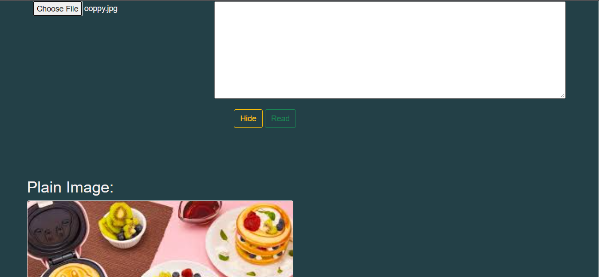
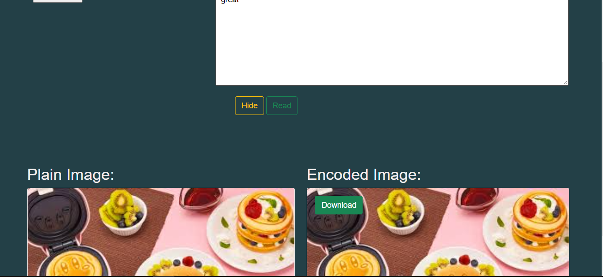
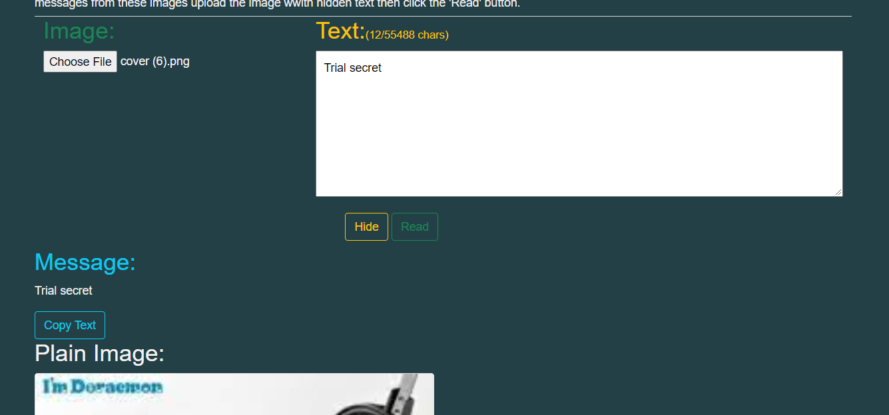
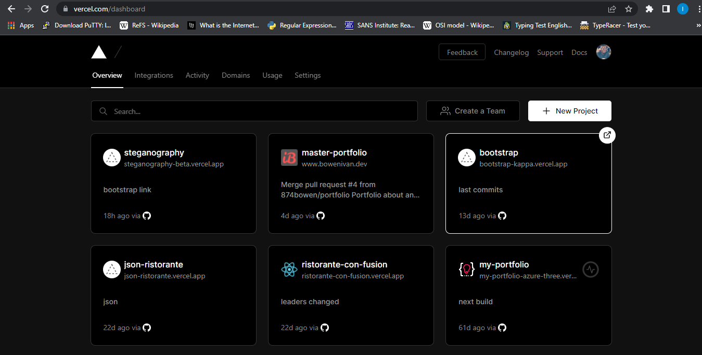
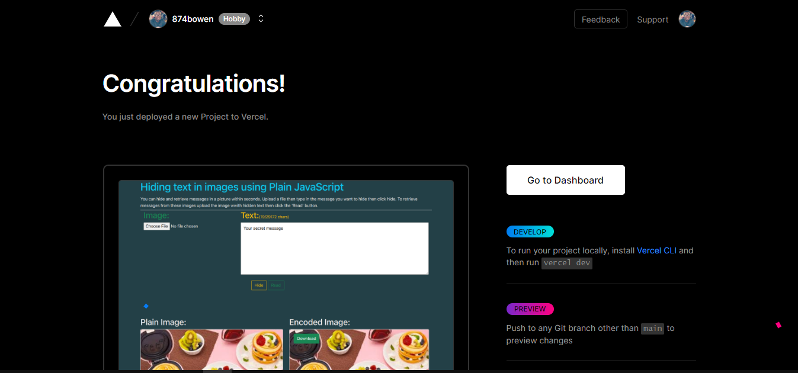

# Hiding text in Images using Plain JavaScript

Steganography is the process of concealing information in an image or any other digital artifact. Steganography is used to conceal text from unauthorized parties. With JavaScript we can easily use steganography.js to assist us in hiding/encoding data inside images and decoding/viewing the hidden message. Let's explore on how we can achieve this.

## Github

Check out the complete source code in this   [GitHub Repository](https://github.com/874bowen/steganography-with-js.git).

## Pre-requisites
To follow along through this article you are required to have: 
- Basic knowledge of HTML
- Knowledge in Javascript
- Some knowledge in Bootstrap

## Introduction
We will be using a JavaScript library by Peter Eigenschink [steganography.js](https://www.peter-eigenschink.at/projects/steganographyjs/) to build our project. You can download the library [here](https://www.peter-eigenschink.at/projects/steganographyjs/). This library offers two great functions to decode and encode text in images and abstracts the code behind these functions.

- ```encode``` takes a message as String and a image as Image, HTMLImageElement or String representing the data-URL of the cover image. Returns the data-URL of the image with the encoded message inside.
- ```decode``` takes an image as Image, HTMLImageElement or String representing the data-URL of the image and returns the message which was found in the image.


```bash
git clone https://github.com/874bowen/steganography-with-js.git
```


## Usage
After cloning you can open the ```index.html``` file in your browser. Make sure the ```steganography.min.js``` from the library downloaded is in your js folder. Now let's examine the ```scripts.js``` file. 

## Upload image
On your browser upload an image you want to hide text in also type the text you want to hide and click hide.

- ```handleFileSelect(evt){...}```this function takes the uploaded item makes sure that only an item of type image has been uploaded and renders it to the left on the plain image section.

- ```hide(){...}``` on clicking hide it takes the ```steganography.js``` provides an object called ```steg``` which we can invoke the ```encode``` method and having the text and image as arguments to the method. We then unhide the encoded image section.<br>```javascript
cover.src = steg.encode(textarea.value, img);```<br> 
Click the 'download' button to save the encoded image
- ```read()``` upload the encoded image for decoding then click 'read' button this executes the read() function which decodes the encoded image using the ```decode``` function by steganography.js ,unhides the message area and fills the textarea with the secret message. Click on copy button to copy your secret message.   


## Deploying your application to vercel
When you have pushed your project to github. Go to [Vercel](https://vercel.com/signup?next=%2Fdashboard) and sign up with github. Go to dashboard  Click new project and import your github project. Click deploy to deploy your project on Vercel.  Nice! we just deployed our application to vercel. Click [this link](https://steganography-with-js.vercel.app/) to view the deployed project.

## Conclusion
In conclusion, we saw how we can encode and decode text in images using steganography.js and JavaScript. We also learnt how to deploy our application on Vercel